# 字符残缺检测系统 — 期末大作业报告

| 学院 | 计算机学院 |
|------|-----------|
| **专业** | 物联网工程 |
| **班级** | 2306班 |
| **姓名** | 黄浩城、莫顺彬 |

## 4.2 系统框架设计（30分）

### 模板设计部分（12分）

#### 设计思路（4分）

模板设计模块负责建立检测基准。用户加载一张标准模板图片后，通过鼠标拖拽在图片上标记一个或多个感兴趣区域（ROI），系统自动提取每个 ROI 的子图像作为后续残缺检测的参照。配置以 JSON 文件保存，模板图像以 base64 编码嵌入 JSON，保证配置自包含，不依赖原始图片路径。

#### 功能架构图（4分）

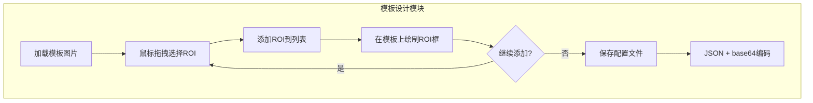
```mermaid
graph TD
    subgraph 模板设计模块
        A[加载模板图片] --> B[鼠标拖拽选择ROI]
        B --> C[添加ROI到列表]
        C --> D[在模板上绘制ROI框]
        D --> E{继续添加?}
        E -->|是| B
        E -->|否| F[保存配置文件]
        F --> G[JSON + base64编码]
    end
```

#### 模块功能说明（4分）

| 功能 | 说明 |
|------|------|
| 加载模板图片 | 读取 PNG/JPG/BMP/TIF 格式图片，校验合法性，清空旧 ROI |
| ROI 选择 | 鼠标拖拽模式：按下记录起点 → 移动实时绘制矩形框 → 释放时确认区域 |
| ROI 管理 | 添加、删除、列表浏览，选中高亮显示（绿色边框） |
| 配置保存 | 将模板信息与所有 ROI 参数（位置、子图像）序列化为独立 JSON 文件 |
| 配置加载 | 从 JSON 反序列化还原模板 + ROI，支持跨设备迁移 |

### 检测模块部分（18分）

#### 设计思路（6分）

检测模块接收待测图片后依次执行四步流水线：**倾斜矫正 → 模板匹配定位 → ROI 精对齐 → 残缺判定**。倾斜矫正通过边缘检测 + 霍夫变换计算图片旋转角度并进行仿射变换补偿。模板匹配使用归一化互相关（NCC）找到模板在待测图中的位置。对每个预定义的 ROI，在匹配结果周边做局部精匹配以提高对齐精度。最后将对齐后的测试区域与模板区域做 NCC 比对，分数低于阈值则判为残缺。

#### 功能架构图（6分）

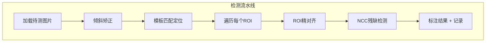
```mermaid
graph TD
    subgraph 检测流水线
        A[加载待测图片] --> B[倾斜矫正]
        B --> C[模板匹配定位]
        C --> D[遍历每个ROI]
        D --> E[ROI精对齐]
        E --> F[NCC残缺检测]
        F --> G[标注结果 + 记录]
    end
```

#### 模块功能说明（6分）

| 功能 | 说明 |
|------|------|
| 单张检测 | 加载单张图片，执行完整流水线，更新界面 |
| 批量检测 | 多张图片逐张执行检测流水线 |
| 倾斜矫正 | Canny + HoughLinesP → 中位数角度 → warpAffine 旋转补偿 |
| 模板匹配 | NCC 归一化互相关全图搜索，返回最佳匹配点 |
| ROI 对齐 | 在匹配点周边搜索窗口内做局部 NCC 精匹配 |
| 残缺检测 | ROI 区域 NCC 比对，defectScore = 1 - NCC 分数，阈值 0.15 |
| 结果摘要 | 检测页面底部显示每条 ROI 的状态和残缺百分比 |

---

## 4.3 系统详细设计（57分）

### A）模板设计部分（15分）

#### 1. 读取模板图片（1分）

| 函数 | 功能 |
|------|------|
| `MainWindow::on_btnLoadTemplate_clicked()` | 打开文件对话框选择图片，调用 `loadTemplateImage` |
| `MainWindow::loadTemplateImage(path)` | 读取图片、校验、清空旧 ROI、更新界面 |
| `ImageUtil::imreadSafe(path)` | 以二进制流形式通过 `imdecode` 读取（支持中文路径） |

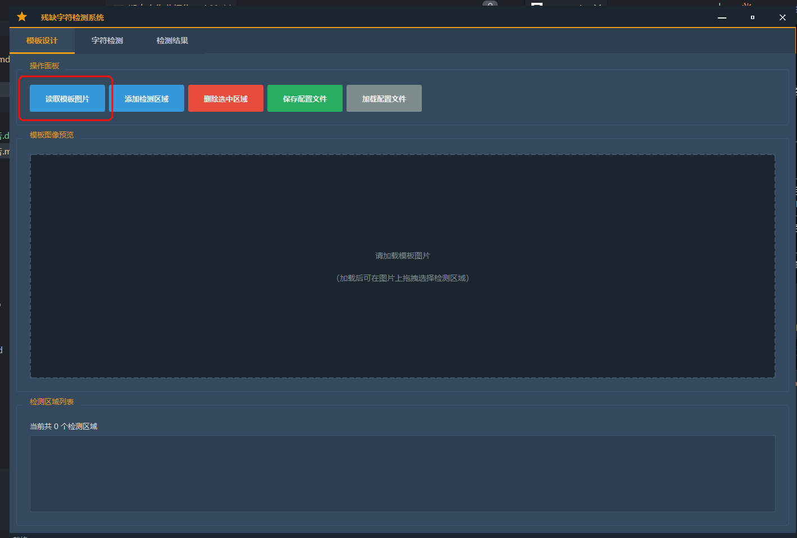
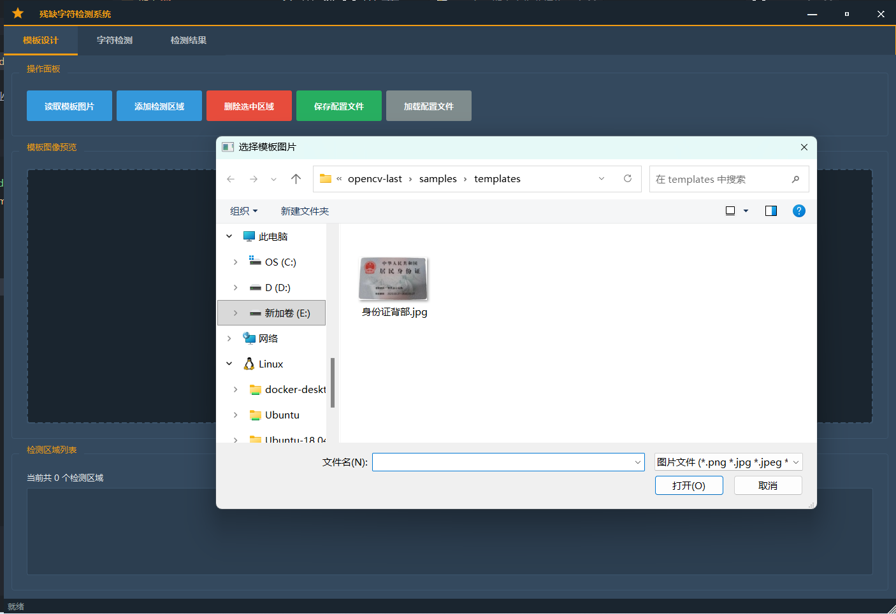
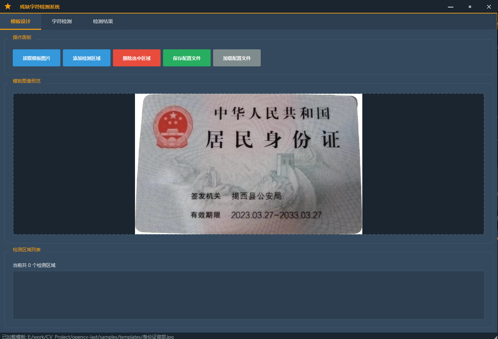

---

#### 2. 设定检测区域（7分）

**流程图（3分）：**

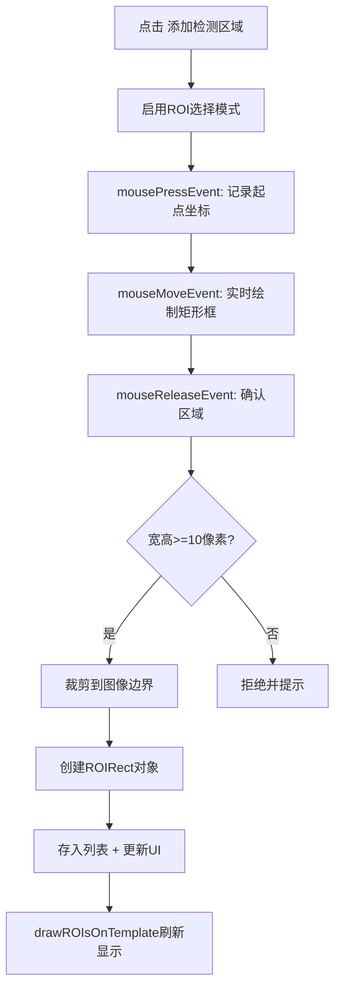
```mermaid
graph TD
    A[点击 添加检测区域] --> B[启用ROI选择模式]
    B --> C[mousePressEvent: 记录起点坐标]
    C --> D[mouseMoveEvent: 实时绘制矩形框]
    D --> E[mouseReleaseEvent: 确认区域]
    E --> F{宽高>=10像素?}
    F -->|是| G[裁剪到图像边界]
    G --> H[创建ROIRect对象]
    H --> I[存入列表 + 更新UI]
    I --> J[drawROIsOnTemplate刷新显示]
    F -->|否| K[拒绝并提示]
```

**函数说明（2分）：**

| 函数 | 参数 | 功能 |
|------|------|------|
| `on_btnAddROI_clicked()` | 无 | 进入 ROI 选择模式，状态栏提示 |
| `mousePressEvent(event)` | 鼠标事件 | 记录 ROI 拖拽起点（图像坐标） |
| `mouseMoveEvent(event)` | 鼠标事件 | 使用 QPainter 在 pixmap 上叠加绘制选择矩形 |
| `mouseReleaseEvent(event)` | 鼠标事件 | 将起终点转换为标准矩形，调用 `addROI` |
| `addROI(rect)` | `cv::Rect` | 裁剪到图像边界、创建 `ROIRect`（含子图像）、追加到列表 |
| `updateROIList(index)` | 目标选中行 | 刷新列表控件，自动选中新添加的 ROI |
| `drawROIsOnTemplate()` | 无 | 在模板图上绘制所有 ROI 边框（当前选中为绿色，其余红色） |

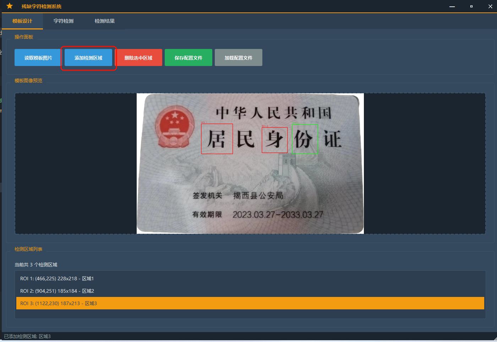

---

#### 3. 保存配置文件（7分）

**流程图（3分）：**

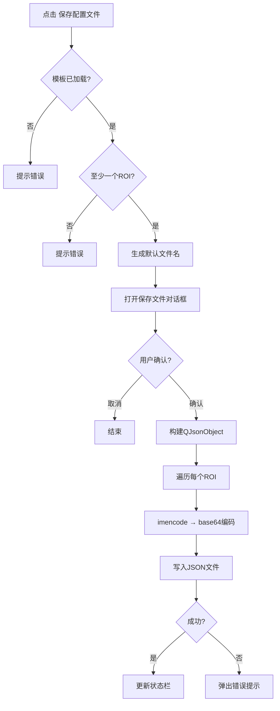
```mermaid
graph TD
    A[点击 保存配置文件] --> B{模板已加载?}
    B -->|否| C[提示错误]
    B -->|是| D{至少一个ROI?}
    D -->|否| E[提示错误]
    D -->|是| F[生成默认文件名]
    F --> G[打开保存文件对话框]
    G --> H{用户确认?}
    H -->|取消| I[结束]
    H -->|确认| J[构建QJsonObject]
    J --> K[遍历每个ROI]
    K --> L[imencode → base64编码]
    L --> M[写入JSON文件]
    M --> N{成功?}
    N -->|是| O[更新状态栏]
    N -->|否| P[弹出错误提示]
```

**函数说明（2分）：**

| 函数 | 参数 | 功能 |
|------|------|------|
| `on_btnSaveConfig_clicked()` | 无 | 校验状态 → 生成默认路径 → 调用 `ConfigManager::save()` |
| `ConfigManager::save(path, templateImage, templateImagePath, roiList)` | 保存路径、模板图、模板路径、ROI 列表 | 序列化为 JSON；每个 ROI 的 `templateImage` 通过 `imencode(".png")` 编码后 base64 嵌入 |

**关键设计：**

- 模板路径存储为相对路径 `templates/xxx.png`，加载时自动解析到 `samples/` 目录
- ROI 子图以 base64 形式嵌入 JSON，配置文件可脱离原始图片独立迁移

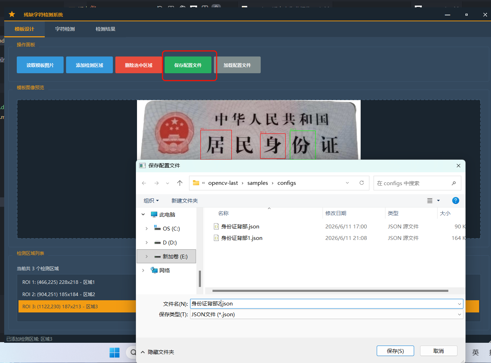

---

### B）系统检测部分（42分）

#### 1. 读取配置文件及模板初始化（7分）

**流程图（3分）：**

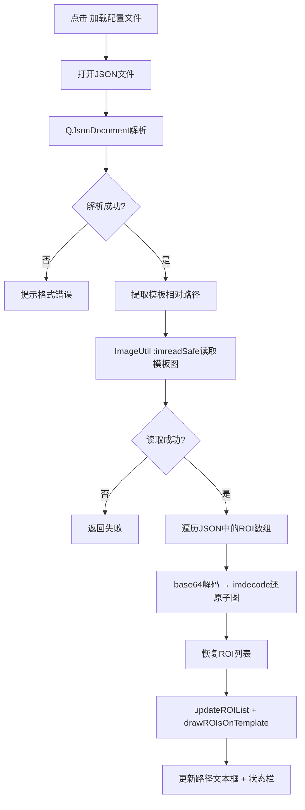
```mermaid
graph TD
    A[点击 加载配置文件] --> B[打开JSON文件]
    B --> C[QJsonDocument解析]
    C --> D{解析成功?}
    D -->|否| E[提示格式错误]
    D -->|是| F[提取模板相对路径]
    F --> G[ImageUtil::imreadSafe读取模板图]
    G --> H{读取成功?}
    H -->|否| I[返回失败]
    H -->|是| J[遍历JSON中的ROI数组]
    J --> K[base64解码 → imdecode还原子图]
    K --> L[恢复ROI列表]
    L --> M[updateROIList + drawROIsOnTemplate]
    M --> N[更新路径文本框 + 状态栏]
```

**函数说明（2分）：**

| 函数 | 参数 | 功能 |
|------|------|------|
| `on_btnLoadConfig_clicked()` | 无 | 打开文件对话框 → 调用 `ConfigManager::load()` → 恢复模板 + ROI |
| `ConfigManager::load(path, outData)` | 路径、输出结构体 | 解析 JSON，base64 解码 ROI 子图，返回模板图和 ROI 列表 |
| `ConfigData` | 结构体 | 包含 `templateImage`、`templatePath`、`roiList` |

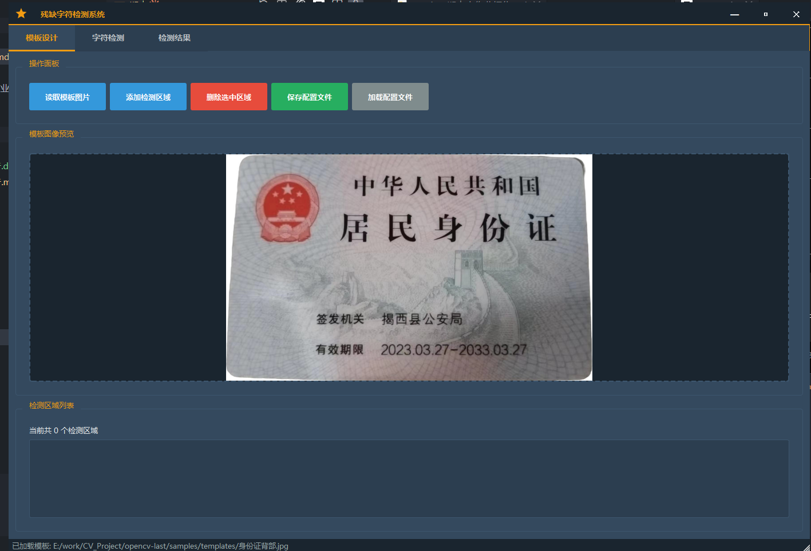
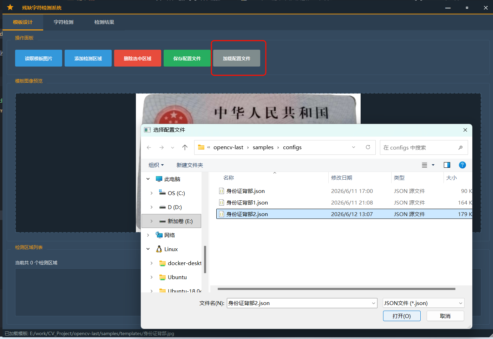
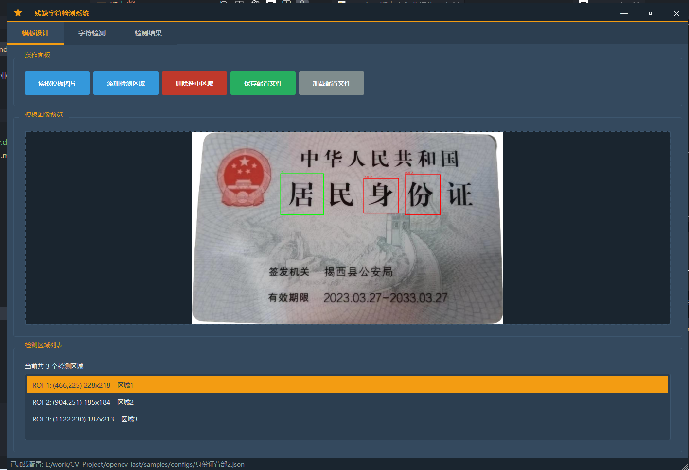
---

#### 2. 判断倾斜及旋转矫正（7分）

**流程图（3分）：**

```mermaid
graph TD
    A[输入待测图片] --> B[灰度化]
    B --> C[高斯模糊去噪]
    C --> D[Canny边缘检测]
    D --> E[HoughLinesP检测直线]
    E --> F{检测到直线?}
    F -->|否| G[返回0.0不做矫正]
    F -->|是| H[计算每条直线角度]
    H --> I[过滤 ±45° 以外角度]
    I --> J[排序后取中位数角度]
    J --> K{|角度| < 1°?}
    K -->|是| L[跳过矫正]
    K -->|否| M[计算旋转后画布大小]
    M --> N[warpAffine仿射变换]
    N --> O[返回矫正角度]
```

**函数说明（2分）：**

| 函数 | 参数 | 返回 | 功能 |
|------|------|------|------|
| `Detector::detectSkewAndCorrect(image)` | `cv::Mat&` 待测图 | `double` 矫正角度（0.0=无操作） | Canny → HoughLinesP → 中位数角度提取 → warpAffine 旋转补偿，自动扩展画布避免裁剪 |
| `SkewConstants` | 命名常量 | — | `GAUSS_KERNEL=3` `CANNY_LOW=50` `CANNY_HIGH=150` `HOUGH_THRESHOLD=50` `HOUGH_MAX_GAP=50` `MAX_LINE_ANGLE=45` `MIN_ANGLE=1.0` |

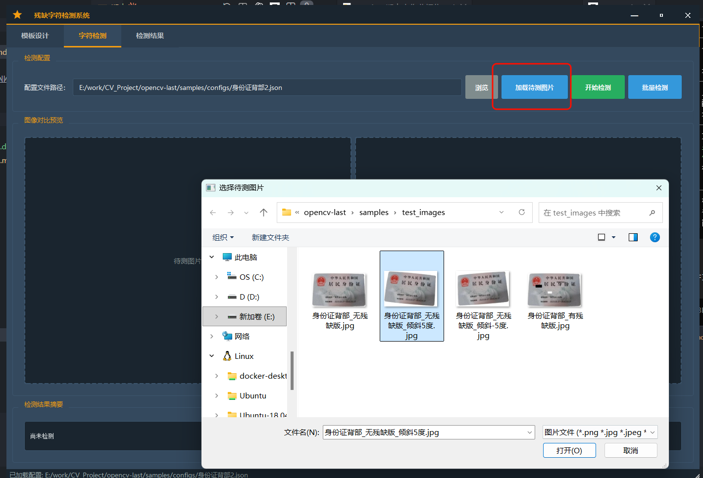
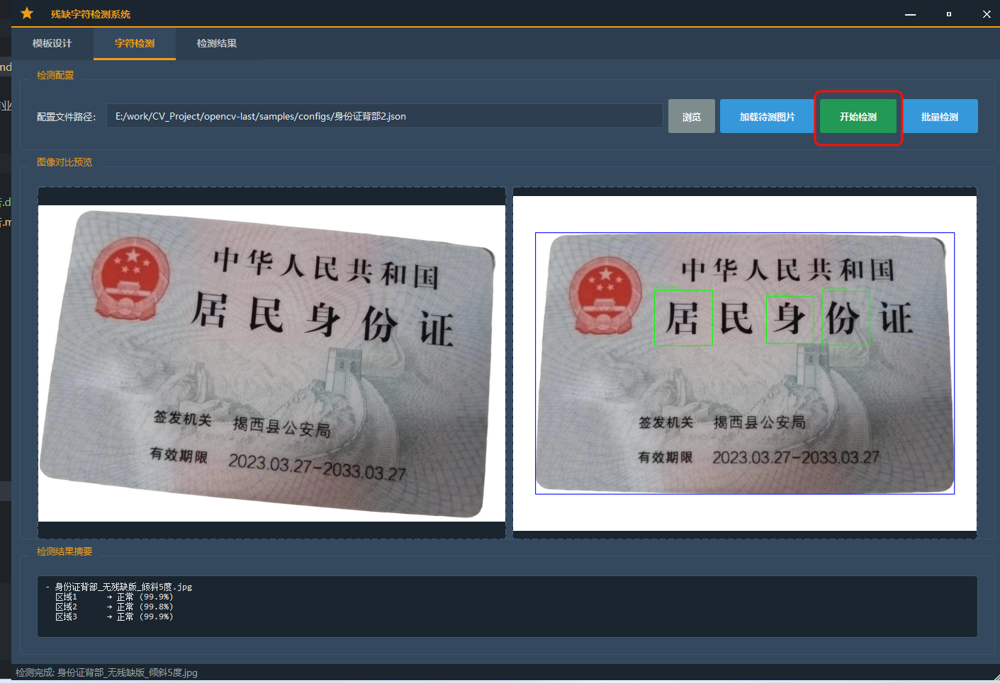
---

#### 3. 模板匹配定位（7分）

**流程图（3分）：**

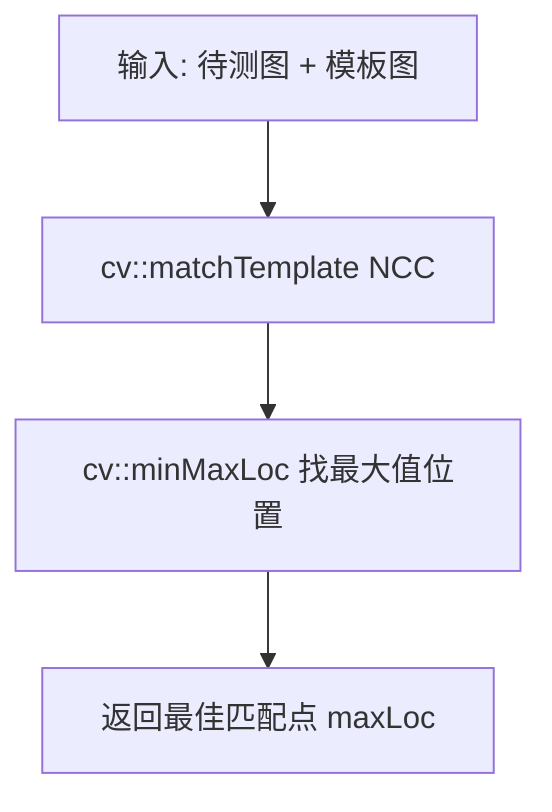
```mermaid
graph TD
    A[输入: 待测图 + 模板图] --> B[cv::matchTemplate NCC]
    B --> C[cv::minMaxLoc 找最大值位置]
    C --> D[返回最佳匹配点 maxLoc]
```

**函数说明（2分）：**

| 函数 | 参数 | 返回 | 功能 |
|------|------|------|------|
| `Detector::templateMatch(testImage, templateImage)` | `cv::Mat` 待测图，`cv::Mat` 模板图 | `cv::Point` 最佳匹配左上角 | 使用 `cv::TM_CCOEFF_NORMED` 进行全图归一化互相关匹配 |

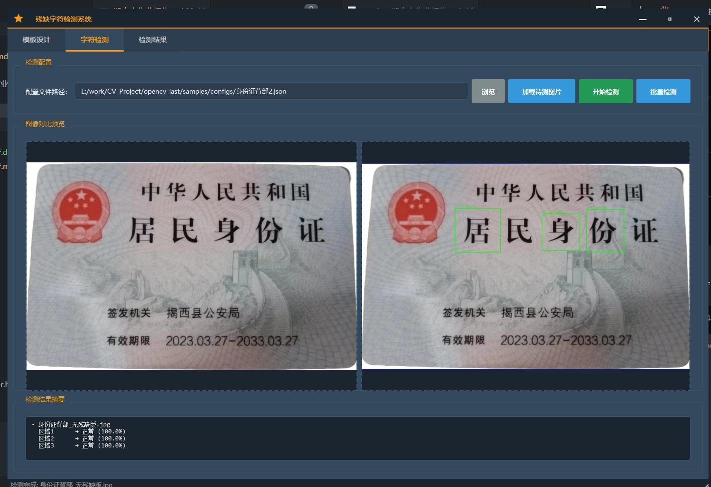

---

#### 4. 计算及提取字符检测区域（7分）

**流程图（3分）：**

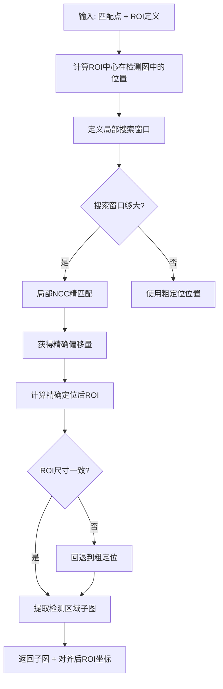
```mermaid
graph TD
    A[输入: 匹配点 + ROI定义] --> B[计算ROI中心在检测图中的位置]
    B --> C[定义局部搜索窗口]
    C --> D{搜索窗口够大?}
    D -->|是| E[局部NCC精匹配]
    E --> F[获得精确偏移量]
    F --> G[计算精确定位后ROI]
    D -->|否| H[使用粗定位位置]
    G --> I{ROI尺寸一致?}
    I -->|是| J[提取检测区域子图]
    I -->|否| K[回退到粗定位]
    K --> J
    J --> L[返回子图 + 对齐后ROI坐标]
```

**函数说明（2分）：**

| 函数 | 参数 | 返回 | 功能 |
|------|------|------|------|
| `Detector::alignROI(testImage, roiTemplate, roughMatchPoint, roiRect, outAlignedRect)` | 待测图、ROI 模板、粗匹配点、ROI 定义、输出对齐坐标 | `cv::Mat` 对齐后的检测区域 | 在匹配点周边 `min(30, w/3, h/3)` 像素窗口内做局部 NCC 精匹配；若 NCC 区域尺寸不符则回退至粗定位 |

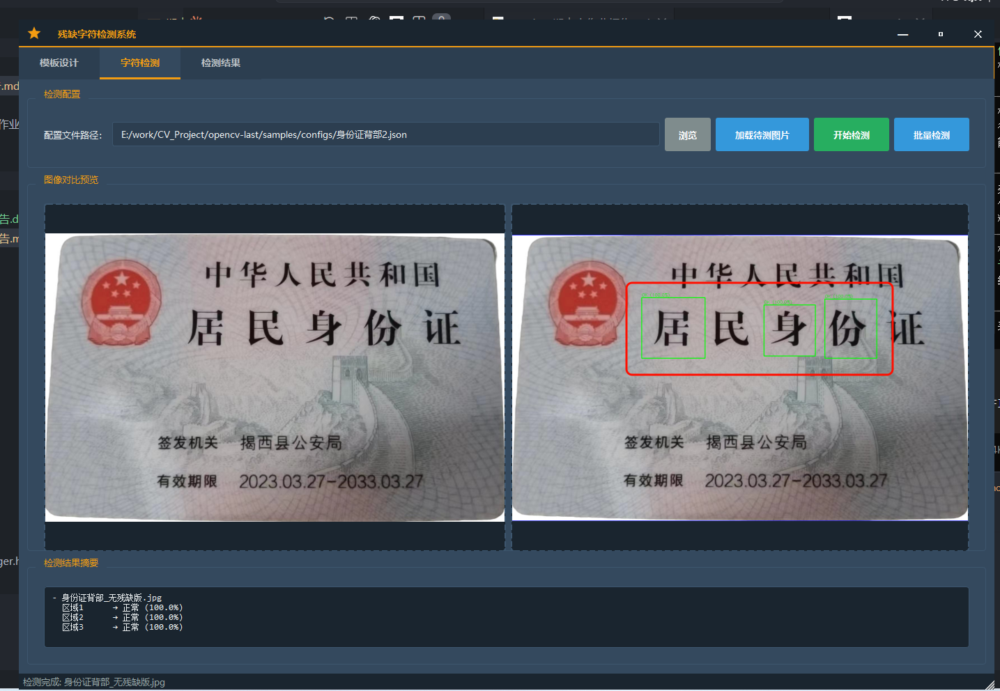

---

#### 5. 字符残缺检测（7分）

**流程图（3分）：**

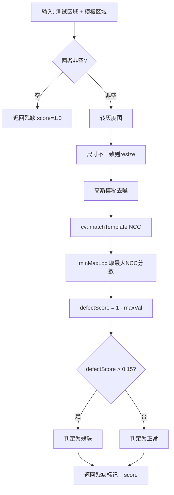
```mermaid
graph TD
    A[输入: 测试区域 + 模板区域] --> B{两者非空?}
    B -->|空| C[返回残缺 score=1.0]
    B -->|非空| D[转灰度图]
    D --> E[尺寸不一致则resize]
    E --> F[高斯模糊去噪]
    F --> G[cv::matchTemplate NCC]
    G --> H[minMaxLoc 取最大NCC分数]
    H --> I[defectScore = 1 - maxVal]
    I --> J{defectScore > 0.15?}
    J -->|是| K[判定为残缺]
    J -->|否| L[判定为正常]
    K --> M[返回残缺标记 + score]
    L --> M
```

**函数说明（2分）：**

| 函数 | 参数 | 返回 | 功能 |
|------|------|------|------|
| `Detector::detectCharacterDefect(testRegion, templateRegion, defectScore)` | 测试区 `cv::Mat`、模板区 `cv::Mat`、输出分数 `double&` | `bool` true=残缺 | 灰度化 → resize 对齐 → 高斯模糊 → NCC 相似度比对；score=1−NCC，阈值 0.15 |
| `DefectConstants` | 命名常量 | — | `GAUSS_KERNEL=5` `DEFECT_SCORE_THRESHOLD=0.15` |

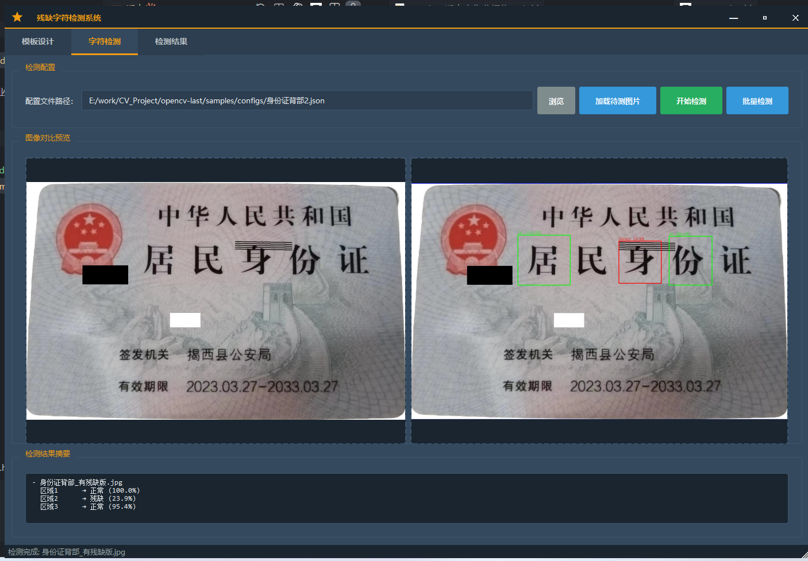

---

#### 6. 显示检测结果并记录到表格（7分）

**流程图（3分）：**

```mermaid
graph TD
    A[遍历所有ROI完成检测] --> B[在结果图上绘制矩形框]
    B --> C[标注 OK (xx%) / Defect: xx%]
    C --> D[ImageUtil::displayImageOnLabel]
    D --> E[创建DetectionResult对象]
    E --> F[追加到全局结果列表]
    F --> G[ResultManager::addToTable]
    G --> H[更新检测页面底部摘要]
    H --> I[更新状态栏]
```

**函数说明（2分）：**

| 函数 | 参数 | 功能 |
|------|------|------|
| `performDetection(imagePath)` | 图片路径 | 执行完整检测流水线，标注结果图、记录表格、更新摘要 |
| `ImageUtil::displayImageOnLabel(label, image, placeholder)` | 目标 label、cv::Mat、占位文字 | 按 label 尺寸等比缩放后设置 QPixmap |
| `ResultManager::addToTable(table, imageId, roiResults)` | QTableWidget、图片序号、ROI 结果列表 | 插入行，跨行合并序号/图片名/检测时间，每个 ROI 独立结果 |
| `ResultManager::exportToCsv(path, resultList)` | 导出路径、结果列表 | 写入 UTF-8 CSV，含序号、图片名、ROI 名、结果、残缺程度、检测时间 |
| UI 摘要更新 | `imageRoiResults` | 构建 `区域名 → 正常(xx%) / 残缺(xx%)` 文本追加到检测页面底部 |

**表格列定义：**

| 列 | 宽度 | 说明 |
|-----|------|------|
| 序号 | 80px | 图片级流水号，多 ROI 自动跨行合并 |
| 图片名称 | Stretch | 文件名，多 ROI 自动跨行合并 |
| 检测区域 | 200px | ROI 名称 |
| 检测结果 | 120px | 绿色=正常 / 红色=残缺 |
| 检测时间 | 200px | 自动带时间戳，多 ROI 合并 |

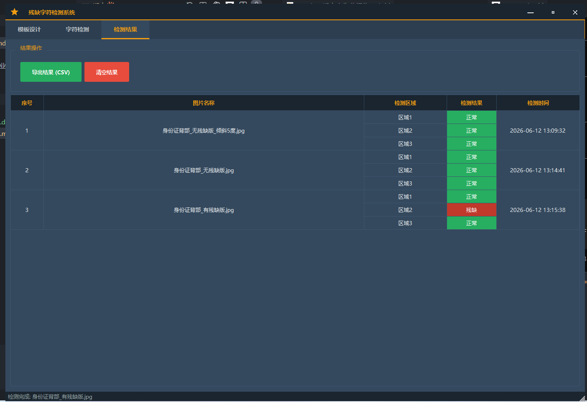

---

## 4.4 系统设计总结（5分）

本系统以 Qt + OpenCV 为技术栈，采用**模板匹配 + NCC 差异比对**方法实现了对印刷字符的自动化残缺检测。系统分为模板设计、字符检测、检测结果三大模块，提供了从模板配置到批量检测、结果导出的完整工作流。

**技术要点：**

- **倾斜矫正**：Canny + HoughLinesP + 中位数角度 + warpAffine，对 ±45° 以内的倾斜具有良好矫正能力
- **ROI 精匹配**：在粗定位基础上附加局部 NCC 搜索，提升了对小偏移/旋转的容忍度
- **残缺判定**：NCC 归一化互相关对光照和对比度变化不敏感，0.15 的阈值在实际测试中对明显残缺和微缺陷有较好区分
- **配置自包含**：ROI 子图以 base64 嵌入 JSON，配置文件可脱离原始图片独立迁移

**可改进方向：**

- 引入深度学习（CNN/分类器）替代 NCC 阈值判定，提升对复杂缺陷的识别率
- 支持非矩形 ROI（多边形/自由形状）
- 添加实时视频流检测模式

---

> **注意**：本文档不包含源代码，所有实现细节以流程图和函数说明表呈现。
