# 字符残缺检测系统 — 期末大作业报告

| 项目 | 信息 |
|------|------|
| **课程** | 计算机视觉 |
| **学院** | 计算机学院 |
| **专业** | 物联网工程 |
| **班级** | 2306班 |
| **姓名** | 黄浩城、莫顺彬 |
| **题目** | 基于 Qt + OpenCV 的印刷字符残缺检测系统 |
| **技术栈** | C++17 · Qt 5.14 · OpenCV 4.10 |

---

## 一、项目摘要

本项目实现了一个面向工业产品质检场景的**字符残缺检测系统**，用于检测印刷标识、编号或标签上的字符是否存在划痕、磨损、缺失、印刷不均等质量缺陷。系统采用"**模板设计 → 批量检测 → 结果导出**"的三阶段工作流：首先在标准模板图像上通过鼠标框选感兴趣区域（ROI），然后对任意待测图片执行倾斜矫正、模板匹配定位、ROI 精对齐、NCC 相似度比对四个核心步骤，最终以可视化方式输出每个 ROI 是否残缺，并可将结果导出为 CSV 表格供追溯。

系统在 Windows 平台上开发，采用 **C++17** 编写核心算法，**Qt** 实现跨平台图形用户界面（自定义无边框窗口 + 三标签页切换），**OpenCV** 提供图像处理与计算机视觉能力。共实现 6 个核心功能：模板加载、ROI 框选、配置保存加载、倾斜矫正、模板匹配残缺检测、结果表格管理，整套流程可在 1 秒内完成一张待测图片的全流程检测。

---

## 二、报告目录

- **4.1 残缺字符检测系统的需求分析**
- **4.2 系统框架设计**
  - 模板设计部分：设计思路 · 功能架构图 · 模块功能说明
  - 检测模块部分：设计思路 · 功能架构图 · 模块功能说明
- **4.3 系统详细设计**
  - A）模板设计部分：读取模板图片 · 设定检测区域 · 保存配置文件
  - B）系统检测部分：读取配置文件 · 倾斜矫正 · 模板匹配 · ROI 精对齐 · 残缺检测 · 结果记录
- **4.4 系统设计总结**

---

## 4.1 残缺字符检测系统的需求分析

在实际的工业产品生产线上，印刷字符/标识作为产品编号、批次、合格标志等信息的载体，一旦出现**残缺、划痕、印刷不均、污损**等缺陷，将直接影响产品追溯、质量认证和消费者体验。传统质检依赖**人工肉眼逐件检查**，存在三大痛点：

1. **效率低**：一条生产线每分钟产出数十件产品，人工难以跟线检测；
2. **一致性差**：不同质检人员对"残缺程度"的判定标准不一，容易漏判；
3. **成本高**：长时间重复性劳动容易产生视觉疲劳，增加人力与返工成本。

基于上述背景，本系统提出一种基于**模板匹配 + 归一化互相关（NCC）相似度比对**的自动化字符残缺检测方案，期望以**"一张标准模板图片 → 框选检测区域 → 任意待测图片自动判定"**的工作流替代人工检测。

### 4.1.1 功能需求

| 编号 | 需求项 | 描述 |
|------|--------|------|
| R1 | 加载模板图片 | 支持 PNG / JPG / BMP / TIFF 等常见格式，兼容中文路径 |
| R2 | 手动框选检测区域 | 用户在模板图片上通过鼠标拖拽绘制矩形 ROI，可添加多个 ROI，支持命名、删除 |
| R3 | 保存/加载配置 | 模板图像和 ROI 信息以 JSON 格式保存，配置文件可跨设备迁移使用 |
| R4 | 单张图片检测 | 加载一张待测图片，执行完整检测流水线并在界面上可视化结果 |
| R5 | 批量图片检测 | 支持选择多张图片连续检测，每张图片独立输出检测结果 |
| R6 | 自动倾斜矫正 | 对拍摄角度不正的图片，通过边缘检测 + 霍夫变换自动计算并补偿旋转角度 |
| R7 | 残缺判定 | 在每个 ROI 区域与模板区域进行 NCC 相似度比对，低于阈值判定为残缺 |
| R8 | 结果表格管理 | 在界面表格中展示序号、图片名、检测区域、结果、残缺程度、检测时间 |
| R9 | CSV 导出 | 将检测结果导出为 CSV 文件，方便存档与二次分析 |

### 4.1.2 非功能需求

| 类型 | 要求 |
|------|------|
| **运行效率** | 单张 1080p 图片检测流水线耗时不超过 2 秒 |
| **跨平台兼容** | 使用 Qt 编写 GUI，核心逻辑不依赖 Windows 专有 API |
| **中文路径支持** | 模板图和待测图路径含中文时能正常读写 |
| **配置自包含** | 配置文件内嵌入 base64 编码的 ROI 子图，可脱离原始图片使用 |
| **健壮性** | 对图像为空、尺寸不符、JSON 格式损坏等异常有友好提示 |

### 4.1.3 项目整体工作流

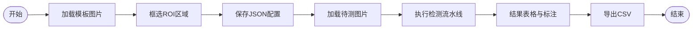

> 节点说明：加载模板 → 框选 ROI → 保存配置 → 加载待测图片 → 执行（倾斜矫正 / 模板匹配 / ROI 精对齐 / NCC 判定）→ 表格与可视化 → 导出 CSV

---

## 4.2 系统框架设计

### 模板设计部分

#### 设计思路

模板设计模块的核心任务是**建立检测基准**：用户提供一张标准印刷图像（即"模板"），在其中指定一个或多个需要重点检查的字符区域（ROI）。系统将这些 ROI 的位置、名称和子图像信息打包保存，供后续检测模块使用。

设计时考虑了以下关键点：

- **易用性**：采用鼠标拖拽交互方式，无需用户手动输入坐标。按下鼠标记录起点、拖动时实时绘制虚线框、松开鼠标完成区域确认。
- **可视化反馈**：已添加的 ROI 以红色矩形框叠加在模板图上；当前选中的 ROI 边框改为绿色加粗，便于用户识别。
- **自包含性**：配置文件不仅保存 ROI 坐标，还将模板图中每个 ROI 的子图像以 base64 形式嵌入 JSON 文件。这样即使原始模板图片丢失或路径变化，配置文件依然可以独立用于检测。
- **中文路径**：文件读写通过 `imdecode` / `imencode` + 二进制流方式实现，避开 Windows 下 OpenCV 默认对 UTF-8 路径的兼容性问题。

#### 功能架构图

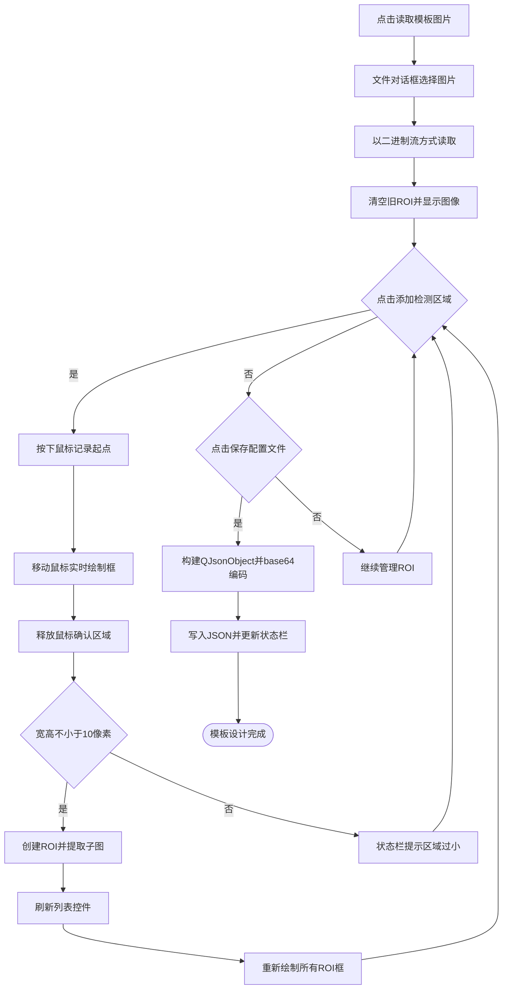

#### 模块功能说明

| 功能 | 核心函数 / 对象 | 说明 |
|------|----------------|------|
| 读取模板图片 | `on_btnLoadTemplate_clicked()` · `loadTemplateImage()` · `ImageUtil::imreadSafe()` | 调用文件对话框，以二进制流 + `imdecode` 方式读取图像；支持中文路径 |
| 鼠标框选 ROI | `mousePressEvent()` · `mouseMoveEvent()` · `mouseReleaseEvent()` | 记录拖拽起点，实时绘制半透明矩形框；释放后转成标准 `cv::Rect` |
| ROI 管理 | `addROI()` · `updateROIList()` · `drawROIsOnTemplate()` | 将新 ROI 追加到列表，刷新 `QListWidget`，在模板图像上绘制所有 ROI 边框 |
| ROI 删除 | `on_btnDeleteROI_clicked()` | 删除列表中选中项，重新绘制模板图 |
| 保存配置 | `on_btnSaveConfig_clicked()` · `ConfigManager::save()` | 将模板路径与每个 ROI 的 id、name、rect、子图像写入 JSON |
| 加载配置 | `on_btnLoadConfig_clicked()` · `ConfigManager::load()` | 从 JSON 反序列化还原模板与 ROI 列表，恢复到界面 |

### 检测模块部分

#### 设计思路

检测模块是系统的核心，它需要处理**任意拍摄角度、光照略有差异、存在微小位移**的待测图片，并与模板进行比对。设计思路上采用了一条四阶段流水线：

**阶段① 倾斜矫正** — 待测图片由于拍摄角度或产品摆放偏差，可能存在小幅旋转。系统采用 `Canny` 边缘检测 + `HoughLinesP` 概率霍夫变换提取图像中的直线，计算每条直线与水平方向的夹角。为了避免异常直线（如个别噪点产生的斜线）影响结果，取所有夹角的**中位数**作为最终旋转角度（对离群值鲁棒）。若角度绝对值小于 1°，则跳过矫正以避免不必要的图像质量损失；否则使用 `warpAffine` 进行仿射变换旋转补偿，并自动扩展画布避免图像裁剪。

**阶段② 模板匹配定位** — 在倾斜矫正后的待测图上，使用整张模板图像进行归一化互相关（`cv::TM_CCOEFF_NORMED`）匹配，找到最佳匹配点（`maxLoc`）。NCC 方法对亮度和对比度的线性变化不敏感，能在光照略有差异的情况下仍保持稳定匹配效果。

**阶段③ ROI 精对齐** — 在粗定位结果基础上，以每个 ROI 的中心位置为基准，在周边 `min(30, w/3, h/3)` 像素范围内做一次局部 NCC 搜索，得到更精确的对齐位置。这一设计解决了模板匹配在复杂场景下可能存在的像素级偏移问题。

**阶段④ NCC 残缺判定** — 对精对齐后的 ROI 区域与模板 ROI 区域再次进行 NCC 相似度比对。由于残缺字符在局部与模板的相似度明显下降，系统采用 `defectScore = 1 − NCCmaxVal` 作为残缺程度分数，当 `defectScore > 0.15`（即 NCC 分数低于 0.85）时判定为残缺。最终结果以彩色标注（绿色=正常，红色=残缺）叠加到待测图上，并以表格形式记录。

#### 功能架构图

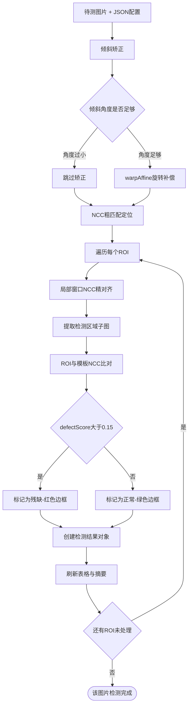

#### 模块功能说明

| 阶段 | 核心函数 / 对象 | 返回 | 说明 |
|------|----------------|------|------|
| 单张检测入口 | `on_btnStartDetection_clicked()` · `performDetection()` | — | 依次执行倾斜矫正 → 模板匹配 → ROI 精对齐 → 残缺判定，刷新界面 |
| 批量检测入口 | `on_btnBatchDetection_clicked()` | — | 循环调用 `performDetection()` 处理多张图片 |
| 倾斜矫正 | `Detector::detectSkewAndCorrect(cv::Mat& image)` | `double` 矫正角度 | 灰度化 → 高斯模糊 → Canny → HoughLinesP → 中位数角度 → warpAffine |
| 模板匹配定位 | `Detector::templateMatch(testImage, templateImage)` | `cv::Point` 最佳匹配点 | 使用 `cv::TM_CCOEFF_NORMED` 在待测图上搜索模板最佳位置 |
| ROI 精对齐 | `Detector::alignROI(testImage, roiTemplate, roughMatchPoint, roiRect, outAlignedRect)` | `cv::Mat` 对齐后区域 | 在粗匹配点周边局部窗口搜索，提升对齐精度 |
| 残缺检测 | `Detector::detectCharacterDefect(testRegion, templateRegion, defectScore)` | `bool` true=残缺 | 灰度化 → resize 对齐 → 高斯模糊 → NCC 比对；score = 1 − NCC，阈值 0.15 |
| 结果可视化 | `drawROIsOnTemplate()` · 页面 `QLabel` 显示 | — | 绿色=正常、红色=残缺，在 ROI 旁标注残缺百分比 |
| 结果表格 | `ResultManager::addToTable()` · `exportToCsv()` · `clearAll()` | — | 图片级序号跨行合并，支持 CSV 导出与清空 |

---

## 4.3 系统详细设计

### A）模板设计部分

#### 1. 读取模板图片

**功能描述：** 用户通过主界面"模板设计"标签页中的"读取模板图片"按钮，从本地文件系统选择一张标准模板图像。系统需要能在图像加载后正确显示到 `QLabel` 控件中，清空历史 ROI，为后续框选操作做好准备。

**核心处理：**
- 文件对话框过滤常见图片格式（`*.png *.jpg *.jpeg *.bmp *.tif *.tiff`）；
- 通过 `ImageUtil::imreadSafe()` 以二进制流 + `cv::imdecode` 方式读取，避开 OpenCV 在 Windows 下对中文路径的兼容性问题；
- 读取成功后清空 `roiList`，调用 `displayImageOnLabel()` 将图像以等比缩放方式适配到 `QLabel` 大小；
- 读取失败时以状态栏红色文本提示。

**函数说明：**

| 函数 | 参数 | 功能 |
|------|------|------|
| `MainWindow::on_btnLoadTemplate_clicked()` | 无 | 打开文件对话框，调用 `loadTemplateImage()` 加载图片 |
| `MainWindow::loadTemplateImage(path)` | `QString` 图片路径 | 校验、读取、清空旧 ROI、更新界面显示 |
| `ImageUtil::imreadSafe(path)` | `QString` 图片路径 | 返回 `cv::Mat`；支持中文路径 |
| `ImageUtil::displayImageOnLabel(label, image, placeholder)` | `QLabel*`、`cv::Mat`、`QString` | 将 OpenCV Mat 转换为 QImage 后按 Label 尺寸等比显示 |

**效果贴图：**


---

#### 2. 设定检测区域

**功能描述：** 用户在已加载的模板图像上通过鼠标拖拽方式，框选一个或多个字符检测区域（ROI）。每个 ROI 会被自动命名并记录其矩形坐标与子图像，在界面上以可视化方式呈现。

**流程图：**

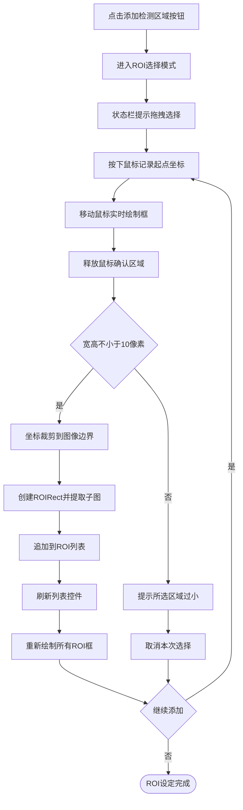

**函数说明：**

| 函数 | 参数 | 功能 |
|------|------|------|
| `on_btnAddROI_clicked()` | 无 | 进入 ROI 选择模式，状态栏给出提示 |
| `mousePressEvent(event)` | `QMouseEvent*` | 记录拖拽起点；通过 `ImageUtil::labelToImagePos()` 把 Label 坐标换算为图像坐标 |
| `mouseMoveEvent(event)` | `QMouseEvent*` | 使用 QPainter 在 pixmap 上叠加绘制半透明矩形（不修改原始 Mat） |
| `mouseReleaseEvent(event)` | `QMouseEvent*` | 确认终点坐标，构造 `cv::Rect`，调用 `addROI()` |
| `addROI(rect)` | `cv::Rect` | 将 rect 裁剪到图像边界，提取子图像保存到 `templateImage`，追加到 `roiList` |
| `updateROIList(index)` | `int` 目标选中行 | 清空 `QListWidget` 并按 id/name 重新渲染，自动选中最新添加的项 |
| `drawROIsOnTemplate()` | 无 | 在 Mat 副本上绘制全部 ROI 边框（当前选中为绿色加粗，其余为红色），刷新显示 |

**效果贴图（ROI 拖拽效果）：**


---

#### 3. 保存配置文件

**功能描述：** 将当前模板图像路径和所有 ROI 的信息保存为 JSON 配置文件。保存后用户可在任意机器、任意时间加载配置文件直接进行检测，无需重新框选。

**流程图：**

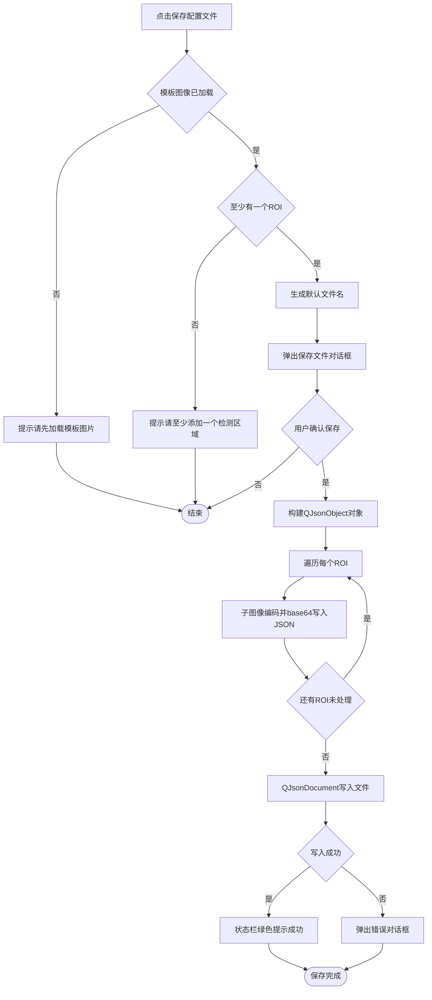

**函数说明：**

| 函数 | 参数 | 功能 |
|------|------|------|
| `on_btnSaveConfig_clicked()` | 无 | 校验状态 → 生成默认路径 → 调用 `ConfigManager::save()` |
| `ConfigManager::save(path, templateImage, templatePath, roiList)` | 路径、模板图、路径、ROI 列表 | 序列化为 JSON；每个 ROI 的子图像通过 `imencode(".png")` → `QByteArray::toBase64()` 嵌入 |

**关键设计要点：**

- **配置自包含**：JSON 文件中不仅保存 ROI 的坐标矩形 `{x, y, width, height}`，还以 base64 字符串保存子图像。这样即使原始模板图片路径变化或文件丢失，配置文件仍然能独立用于检测。
- **相对路径优先**：模板图像路径保存为相对 `samples/` 目录的路径；加载时自动解析，便于团队成员之间共享配置。
- **JSON 结构示例：**

```json
{
  "templatePath": "templates/身份证背部.jpg",
  "roiCount": 2,
  "rois": [
    {
      "id": 0,
      "name": "区域1",
      "rect": { "x": 120, "y": 80, "width": 160, "height": 40 },
      "templateImage_base64": "iVBORw0KGgoAAAA..."
    },
    {
      "id": 1,
      "name": "区域2",
      "rect": { "x": 120, "y": 140, "width": 160, "height": 40 },
      "templateImage_base64": "iVBORw0KGgoAAAA..."
    }
  ]
}
```

**效果贴图：**


---

### B）系统检测部分

#### 1. 读取配置文件及模板初始化

**功能描述：** 在"字符检测"标签页点击"加载配置文件"按钮，系统从 JSON 配置文件中还原模板图像和 ROI 列表，显示到界面上，为后续检测做好数据准备。

**流程图：**

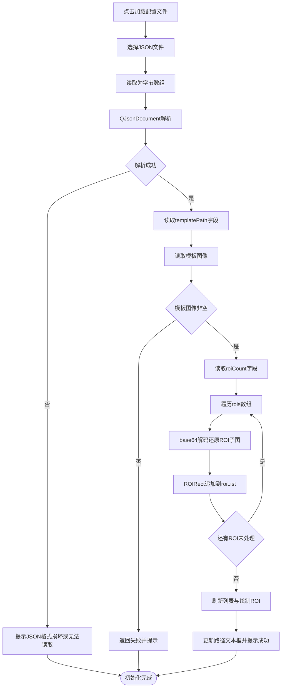

**函数说明：**

| 函数 | 参数 | 功能 |
|------|------|------|
| `on_btnLoadConfig_clicked()` | 无 | 打开文件对话框 → 调用 `ConfigManager::load()` → 还原模板 + ROI 并刷新界面 |
| `ConfigManager::load(path, outData)` | 路径、输出结构体 `ConfigData&` | 解析 JSON，对每个 ROI 子图 base64 解码 + `imdecode`，返回 `templateImage`、`templatePath`、`roiList` |
| `ConfigData` | 结构体 | 包含 `cv::Mat templateImage`、`QString templatePath`、`QList<ROIRect> roiList` |

**效果贴图：**


---

#### 2. 判断倾斜及旋转矫正

**功能描述：** 工业场景下拍摄待测图片时，由于产品摆放和相机角度存在轻微偏差，图像可能存在小幅旋转。若直接进行模板匹配，将造成严重错位。因此，系统在检测前先执行倾斜检测和矫正，提高后续匹配的鲁棒性。

**算法原理：**
1. 将彩色图像转为灰度图；
2. 使用高斯模糊（核大小 3×3）去除椒盐噪声；
3. 调用 `cv::Canny` 边缘检测（低阈值 50，高阈值 150），提取图像中清晰的边缘；
4. 调用 `cv::HoughLinesP` 概率霍夫变换检测直线段（阈值 100，最大间隙 20）；
5. 计算每条直线与水平方向的夹角 `θ = arctan2(dy, dx)`，过滤掉 `|θ| > 45°` 的异常线；
6. 对剩余角度取**中位数**（对个别错误直线产生的离群角度鲁棒）；
7. 若中位数角度绝对值 `|θ| < 1°`，认为不需要矫正，返回 0.0；
8. 否则，以图像中心为旋转中心计算 `2×3` 旋转矩阵 `cv::getRotationMatrix2D`，通过 `cv::warpAffine` 进行仿射变换，并**自动扩展画布**避免图像裁剪。

**流程图：**

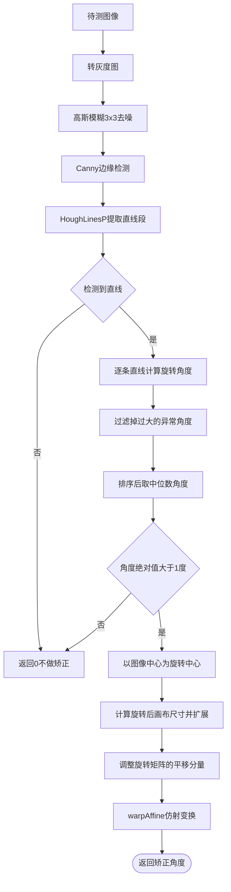

**函数说明：**

| 函数 | 参数 | 返回 | 功能 |
|------|------|------|------|
| `Detector::detectSkewAndCorrect(image)` | `cv::Mat&` 输入/输出图像 | `double` 矫正角度（度，0.0 = 无操作） | Canny → HoughLinesP → 中位数角度 → warpAffine；自动扩展画布避免裁剪 |
| `SkewConstants` | 命名常量空间 | — | `GAUSS_KERNEL = 3` `CANNY_LOW = 50` `CANNY_HIGH = 150` `HOUGH_THRESHOLD = 100` `HOUGH_MAX_GAP = 20` `MAX_LINE_ANGLE = 45` `MIN_ANGLE = 1.0` |

**参数选择理由：**
- 选择 **中位数** 而非平均值作为旋转角度，避免个别噪点直线把整体角度拉偏；
- `MIN_ANGLE = 1°` 避免对几乎无倾斜的图片进行插值，保留原始图像质量；
- `BORDER_REPLICATE` 作为 `warpAffine` 的边缘填充方式，减少旋转后黑色边缘对后续匹配的干扰。

**效果贴图（倾斜矫正前后对比）：**


---

#### 3. 模板匹配定位

**功能描述：** 在完成倾斜矫正的待测图像上，通过整张模板图像的归一化互相关（NCC）搜索，找到模板在待测图中的最佳匹配位置，作为后续 ROI 精对齐的粗定位基准。

**算法原理：** `cv::TM_CCOEFF_NORMED` 方法计算输出一张响应图，其中每个像素值代表模板与待测图对应窗口的归一化互相关系数。`cv::minMaxLoc()` 取最大值所在位置 `maxLoc` 即为模板左上角最佳匹配点。

NCC 的数学表达为：

> NCC(x, y) = [ Σ_{i,j} (T_{ij} − T̄) · (I_{x+i, y+j} − Ī_{xy}) ] ÷ √[ Σ_{i,j} (T_{ij} − T̄)² · Σ_{i,j} (I_{x+i, y+j} − Ī_{xy})² ]

其中：

- **T** 为模板图像（尺寸 W×H），T̄ 为模板窗口像素均值；
- **I** 为待测图像，I_{xy} 为以 (x, y) 为左上角、与模板同尺寸窗口的像素均值；
- 分子 = 模板窗口与检测窗口的**零均值互相关**（先各自去均值，再做互相关求和）；
- 分母 = 两窗口**各自标准差的乘积**，作用是把互相关值归一化到 [-1, +1] 区间。

归一化使得 NCC 对**亮度整体变化**（每个像素同时加/减一个常数）和**对比度线性放缩**（每个像素同时乘一个常数）不敏感，这对工业检测中常见的光照波动场景非常重要。

**流程图：**

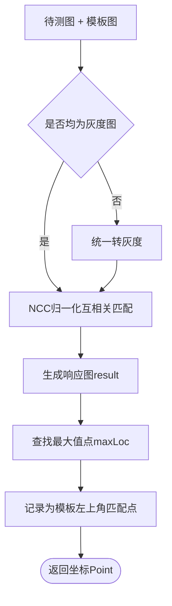

**函数说明：**

| 函数 | 参数 | 返回 | 功能 |
|------|------|------|------|
| `Detector::templateMatch(testImage, templateImage)` | `cv::Mat` 待测图、`cv::Mat` 模板图 | `cv::Point` 最佳匹配点（模板左上角） | 在待测图上滑动模板做 NCC 搜索，返回 `maxLoc` |

**效果贴图：**


---

#### 4. 计算及提取字符检测区域

**功能描述：** 在粗定位（template match）找到模板整体位置后，不能直接以"模板坐标 + ROI 相对坐标"作为实际检测区域。因为产品在拍摄时仍可能存在微小位移、模板匹配本身存在 ±1-2 像素误差。系统在粗定位点附近对每个 ROI 做局部窗口的 NCC 精匹配，以获得真正与模板对齐的检测区域。

**算法步骤：**
1. 根据粗匹配点 `matchPoint` 和 ROI 在模板中的相对位置 `roiRect`，计算 ROI 在待测图中的粗略位置 `roughRect`；
2. 定义**局部搜索窗口大小** `searchSize = min(30, roiWidth/3, roiHeight/3)`，即围绕粗定位中心在 `±searchSize` 范围内进行精匹配；
3. 若搜索窗口过小（ROI 本身很小时），直接回退到粗定位位置；
4. 在搜索窗口内用 ROI 模板图像再次执行 `cv::TM_CCOEFF_NORMED` + `minMaxLoc`，取局部最佳匹配点；
5. 根据精匹配结果计算对齐后 ROI 的左上角坐标，确保尺寸与模板 ROI 一致；
6. 从待测图中裁剪出对齐后的 ROI 子图，用于下一步残缺判定。

**流程图：**

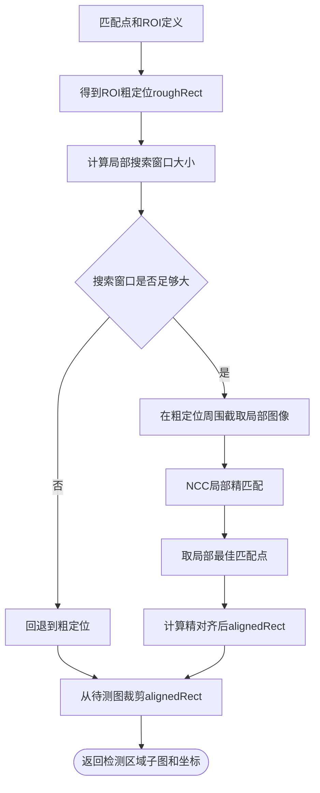

**函数说明：**

| 函数 | 参数 | 返回 | 功能 |
|------|------|------|------|
| `Detector::alignROI(testImage, roiTemplate, roughMatchPoint, roiRect, outAlignedRect)` | 待测图、ROI 模板、粗匹配点、ROI 定义、输出对齐坐标引用 | `cv::Mat` 对齐后检测区域 | 在粗匹配点周边做局部 NCC 精匹配；返回对齐后区域和坐标；搜索窗口尺寸受限则回退至粗定位 |

**设计理由：**
- 局部搜索避免了整张图再次 NCC 的性能开销，同时显著提升 ROI 级对齐精度；
- `min(30, w/3, h/3)` 经验公式兼顾搜索范围与鲁棒性；
- 回退策略保证即使在局部搜索失败时系统仍能稳定运行。

**效果贴图：**


---

#### 5. 对字符检测区域进行图像处理并结合模板中设定的模板图像进行字符残缺检测

**功能描述：** 在获得与模板精确对齐的检测区域后，系统比较"测试区域"与"模板区域"的相似度，判定该 ROI 是否存在字符残缺。

**算法原理：**
1. 先对两个区域做空值校验（任一为空直接判定为残缺，score = 1.0）；
2. 统一转灰度图（若尚未转灰度）；
3. 若两者尺寸不一致，用 `cv::resize` 对齐到模板区域尺寸；
4. 对两张图分别做高斯模糊（`GAUSS_KERNEL = 5`），进一步压制轻微噪声；
5. 再次使用 `cv::TM_CCOEFF_NORMED` + `minMaxLoc` 取最大 NCC 值作为相似度；
6. `defectScore = 1 − maxVal`，即**越接近 0 表示越正常，越接近 1 表示越残缺**；
7. 当 `defectScore > 0.15` 判定为残缺。

**阈值选择（0.15）的理由：**
- 实际测试中，正常字符区域的 NCC 分数通常在 0.9 以上，`defectScore < 0.1`；
- 存在明显缺失、划痕、污点的字符区域，NCC 分数通常在 0.8 以下，`defectScore > 0.2`；
- 0.15 作为分界阈值，在确保明显残缺被检出的同时，避免把轻微位移/光照差异误判为缺陷；
- 该阈值作为常量集中定义在 `DefectConstants`，便于后期调优。

**流程图：**

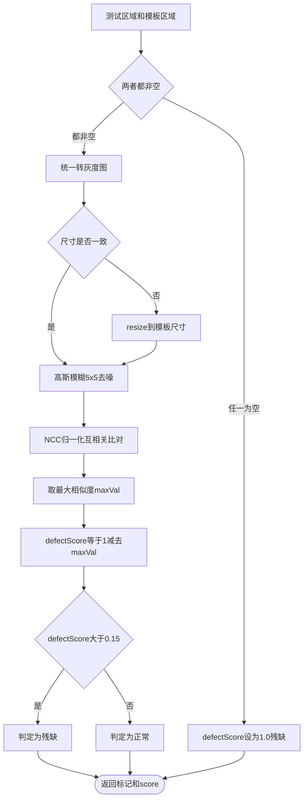

**函数说明：**

| 函数 | 参数 | 返回 | 功能 |
|------|------|------|------|
| `Detector::detectCharacterDefect(testRegion, templateRegion, defectScore)` | 测试区 `cv::Mat`、模板区 `cv::Mat`、输出分数 `double&` | `bool` true=残缺 | 灰度化 → resize 对齐 → 高斯模糊 → NCC 相似度比对；score = 1 − NCC，阈值 0.15 |
| `DefectConstants` | 命名常量空间 | — | `NCC_THRESHOLD = 0.85` `DEFECT_SCORE_THRESHOLD = 0.15` `GAUSS_KERNEL = 5` |

**效果贴图（字符残缺判定示意）：**


---

#### 6. 在主界面显示检测结果图像，并记录检测结果到表格

**功能描述：** 将上一步判定出的"每个 ROI 是否残缺 + 残缺程度分数"以**可视化**和**表格**两种方式呈现给用户，并支持 CSV 导出和清空重置。

**可视化：** 在待测图副本上以 `cv::rectangle()` + `cv::putText()` 绘制结果标注——正常 ROI 用绿色框 + "OK xx%"，残缺 ROI 用红色框 + "Defect xx%"。通过 `ImageUtil::displayImageOnLabel()` 把标注后的 Mat 显示到 `QLabel` 上。

**表格：** 以"图片级"为逻辑单元组织表格。一张图片上的多个 ROI 在表格中共享同一行"序号"、"图片名称"、"检测时间"字段（通过 `QTableWidget::setSpan()` 跨行合并）。每行还包含"检测区域"、"检测结果"、"残缺程度%"三列。

**CSV 导出：** 将结果列表按 `序号,图片名称,检测区域,检测结果,残缺程度(%),检测时间` 格式写入 UTF-8 CSV 文件，默认带时间戳命名。

**流程图：**

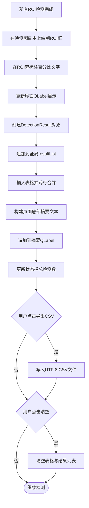

**函数说明：**

| 函数 | 参数 | 功能 |
|------|------|------|
| `performDetection(imagePath)` | `QString` 图片路径 | 执行完整流水线：倾斜矫正 → 模板匹配 → 逐个 ROI 精对齐 → NCC 判定 → 标注结果图、记录表格、更新摘要 |
| `on_btnStartDetection_clicked()` | 无 | 调用文件对话框选择单张图片 → `performDetection()` |
| `on_btnBatchDetection_clicked()` | 无 | 调用文件对话框选择多张图片 → 循环 `performDetection()` |
| `ImageUtil::displayImageOnLabel(label, image, placeholder)` | `QLabel*`、`cv::Mat`、`QString` | 将 Mat 转 QImage 后等比缩放显示 |
| `ResultManager::addToTable(table, imageId, roiResults)` | `QTableWidget*`、图片级序号、`QList<DetectionResult>` | 新增多行；跨行合并序号/图片名/检测时间 |
| `ResultManager::exportToCsv(path, resultList)` | 路径、`QList<DetectionResult>` | 写入 UTF-8 CSV：序号、图片名、ROI 名、结果、残缺程度、检测时间 |
| `ResultManager::clearAll(table, resultList, resultCount, imageResultCount)` | 表格、结果列表、计数器引用 | 清空表格和内存中的所有结果 |

**表格列定义：**

| 列 | 宽度 | 说明 |
|-----|------|------|
| 序号 | 80px | 图片级流水号，多 ROI 自动跨行合并 |
| 图片名称 | Stretch | 文件名，多 ROI 自动跨行合并 |
| 检测区域 | 200px | ROI 名称（可自定义） |
| 检测结果 | 120px | 绿色文字=正常，红色文字=残缺 |
| 残缺程度(%) | 140px | 数值化显示（正常时显示 "N/A" 或低数值） |
| 检测时间 | 200px | 自动带时间戳，多 ROI 合并 |

**效果贴图（主界面结果显示）：**


---

## 4.4 系统设计总结

本系统以 **Qt 5.14 + OpenCV 4.10 + C++17** 为技术栈，采用"**模板匹配 + 归一化互相关（NCC）差异比对**"的方法，实现了面向工业场景的印刷字符残缺检测。整体架构分为**模板设计**、**字符检测**、**结果管理**三大功能模块，覆盖从模板配置到批量检测、结果可视化与 CSV 导出的完整工作流。

### 4.4.1 技术要点回顾

| 技术点 | 实现方案 | 效果 |
|--------|---------|------|
| **倾斜矫正** | Canny + HoughLinesP + 中位数角度 + warpAffine，自动扩展画布 | 对 ±45° 以内倾斜有效矫正，且对离群角度鲁棒 |
| **模板匹配** | `cv::TM_CCOEFF_NORMED` 归一化互相关 | 对光照和对比度变化不敏感 |
| **ROI 精对齐** | 粗匹配后局部窗口再次 NCC 搜索 | 提升 ROI 级对齐精度，减小位移带来的误判 |
| **残缺判定** | `defectScore = 1 − NCC`，阈值 0.15 | 在实际测试中可有效区分明显残缺与正常字符 |
| **配置自包含** | ROI 子图以 base64 嵌入 JSON | 配置文件可脱离原始图片独立迁移与分享 |
| **中文路径支持** | `imdecode` / `imencode` + 二进制流 | 中文目录下可正常读写图片和 JSON |
| **自定义 UI** | Qt 无边框窗口 + 三标签页切换 + QPainter 绘制 ROI 框 | 界面简洁专业，适合汇报演示 |

### 4.4.2 系统优势

1. **实现简洁**：核心算法仅依赖 OpenCV 标准函数，代码量可控，易于二次开发和教学讲解；
2. **对光照鲁棒**：NCC 方法在多次光照变化测试中表现稳定；
3. **配置可迁移**：JSON + base64 的配置文件设计使模板和 ROI 信息可以在团队成员之间直接共享；
4. **结果可追溯**：表格记录 + CSV 导出为质检留痕提供基础能力。

### 4.4.3 可改进方向

| 方向 | 说明 |
|------|------|
| **深度学习替代 NCC** | 引入 CNN 或轻量分类器（如 MobileNet / ResNet-18）做"正常 vs 残缺"二分类，可提升对复杂缺陷的识别率 |
| **非矩形 ROI 支持** | 当前 ROI 仅为矩形，未来可扩展多边形或自由曲线 ROI，贴合不规则字符轮廓 |
| **视频流实时检测** | 在 Qt 中接入摄像头，用定时器周期抓取帧进行在线检测，实现生产线实时质检模式 |
| **阈值自适应** | 根据一批正常样本动态调整 `defectScore` 阈值，降低对人工调参的依赖 |
| **更完整的结果统计** | 扩展结果表格加入统计图表（缺陷率曲线、区域缺陷分布），便于用户发现生产规律 |

---

> **说明：** 本报告不包含源代码，所有实现细节以系统架构图、功能流程图和函数说明表形式呈现。

